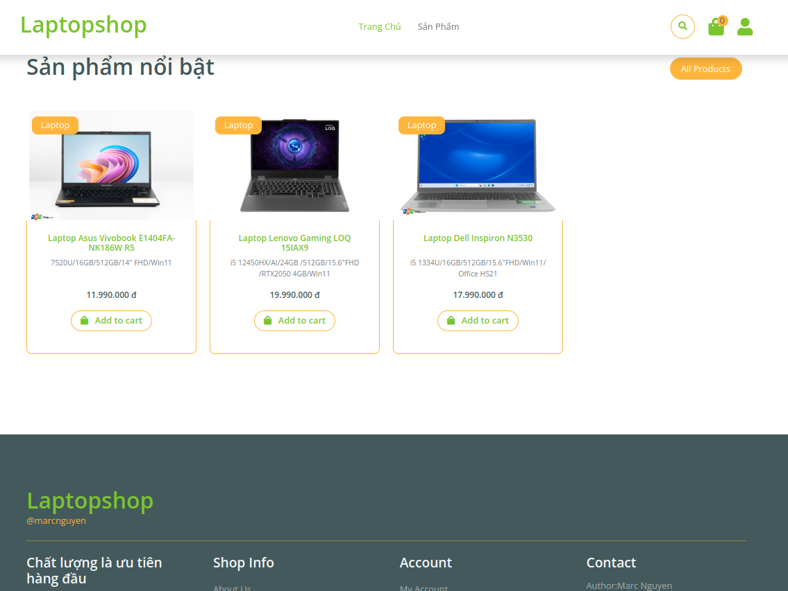
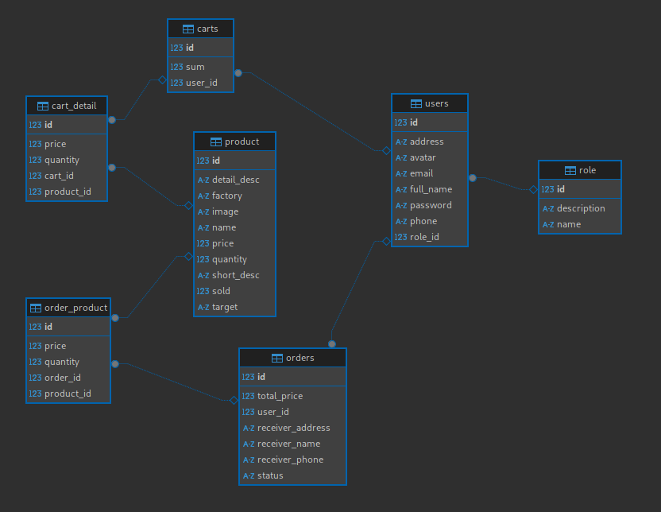
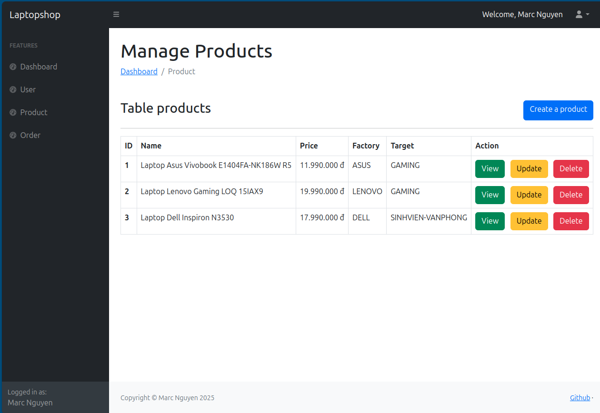
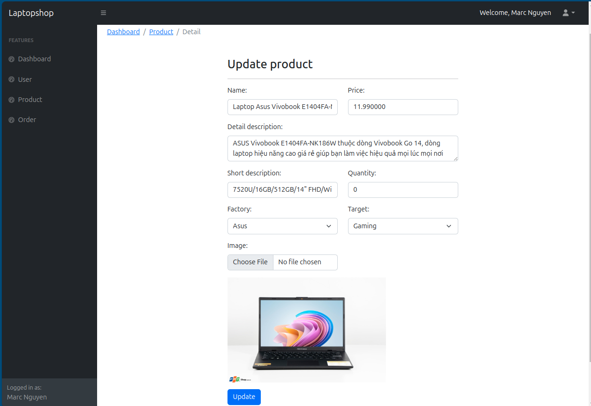
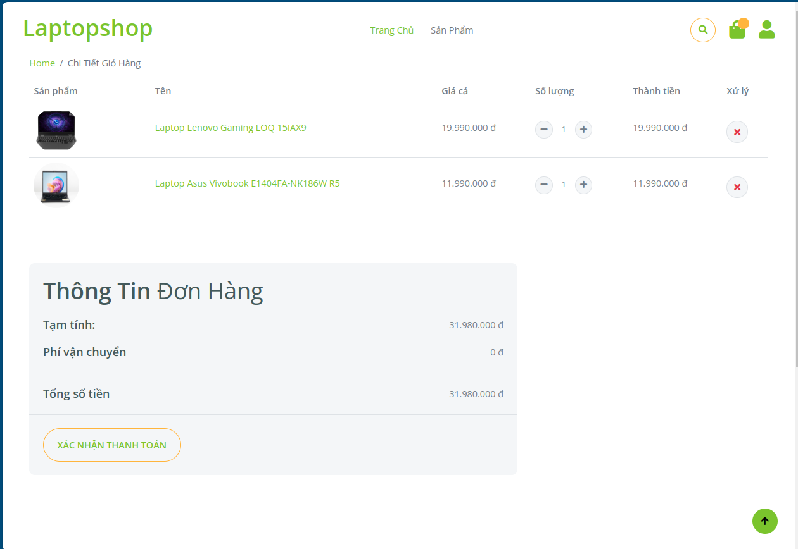
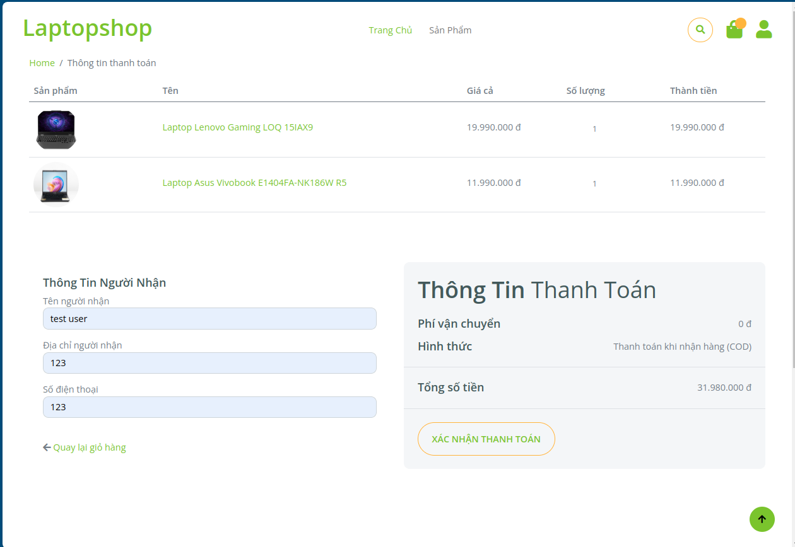
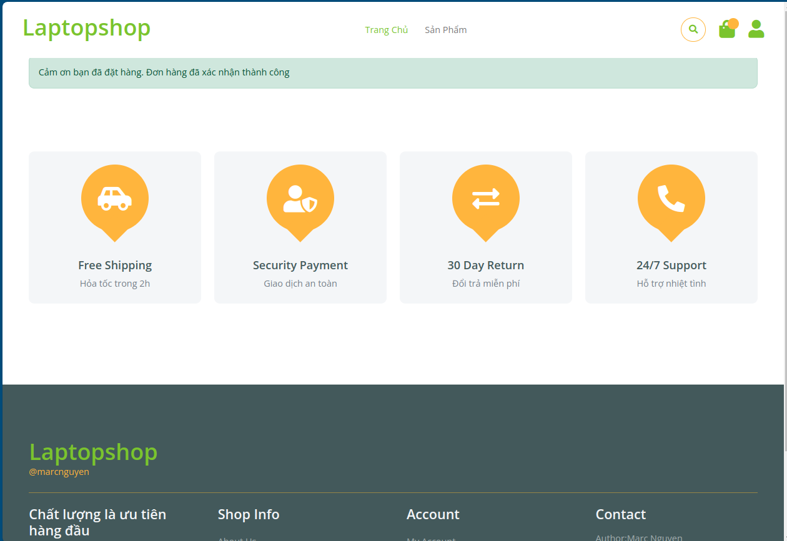

# Laptop Shop

## Tổng quan
Laptop Shop là một ứng dụng web dựa trên Spring Boot được thiết kế để quản lý cửa hàng laptop. Ứng dụng cung cấp các tính năng quản lý sản phẩm, người dùng và giỏ hàng, bao gồm tạo mới, cập nhật, xóa sản phẩm và xác thực người dùng.

## Homepage Screenshots



## Tính năng
- Quản lý sản phẩm (CRUD operations)
- Quản lý người dùng với vai trò và xác thực
- Xử lý file cho hình ảnh sản phẩm và avatar người dùng
- Quản lý giỏ hàng cho các giao dịch mua của người dùng

## Cấu trúc dự án
```
laptop-shop/
├── src/
│   ├── main/
│   │   ├── java/com/techstore/laptop_shop/
│   │   │   ├── controller/       # Controllers để xử lý các yêu cầu HTTP
│   │   │   ├── domain/           # Entity classes cho các mô hình cơ sở dữ liệu
│   │   │   ├── repository/       # Repositories để tương tác với cơ sở dữ liệu
│   │   │   ├── service/          # Business logic và service classes
│   │   └── resources/
│   │       ├── static/           # Static assets (CSS, JS, hình ảnh)
│   │       ├── templates/        # Thymeleaf templates cho giao diện
│   │       └── application.properties # Cấu hình ứng dụng
├── pom.xml                        # Maven dependencies và cấu hình build
└── .gitignore                     # Các file và thư mục bị bỏ qua
```

## Công nghệ sử dụng
-  Spring Boot (Web, Security, Data JPA, Validation)
-  PostgreSQL (Cơ sở dữ liệu)
-  Supabase (Deploy cơ sở dữ liệu)
-  Thymeleaf (Template engine)
-  Maven (Công cụ build)


## Database Schema


## Admin Screenshots



## Order Screenshots


